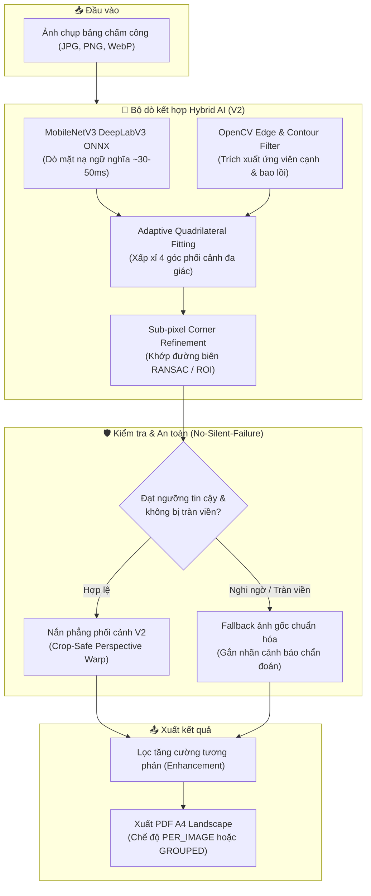

# Attendance Scanner Desktop (Version 2.0)

Ứng dụng desktop offline hiệu năng cao hỗ trợ quét, nắn thẳng và số hóa bảng chấm công / hồ sơ nhân sự theo thư mục nhân viên. Hệ thống kết hợp kiến trúc **Hybrid AI (DeepLabV3 + MobileNetV3 ONNX)** và **OpenCV Computer Vision** tiên tiến, tự động phát hiện file mới/sửa đổi (incremental scan), nắn thẳng tài liệu không biến dạng và xuất PDF A4 landscape theo chế độ **mỗi ảnh một PDF (`PER_IMAGE`)** hoặc **gộp nhiều trang theo nhân viên/kỳ công (`GROUPED`)**.

---

## 1. Tính năng Nổi bật (Version 2.0 Highlights)

* 🧠 **Bộ dò tài liệu Hybrid AI (AI Enhanced Detector)**:
  * Sử dụng mạng nơ-ron ngữ nghĩa **MobileNetV3 + DeepLabV3** chạy suy luận qua **ONNX Runtime CPU** cục bộ (~30–50ms/ảnh).
  * Nhận diện chuẩn xác 100% vùng giấy trên các bối cảnh phức tạp: nền sàn gạch bóng, ga giường hoa văn, bóng đổ tay cầm điện thoại, tài liệu bị đè/xếp chồng nhiều lớp.
* 📐 **Xấp xỉ Tứ giác Phối cảnh (Adaptive Quadrilateral Fitting)**:
  * Khắc phục triệt để lỗi góc $90^\circ$ của bounding box thông thường, giải quyết trọn vẹn hiện tượng dư viền thừa / nuốt nền mặt bàn.
  * Tự động điều chỉnh epsilon thích ứng trên bao lồi (Convex Hull) để tìm đúng 4 góc phối cảnh thực tế của tờ giấy.
* 🔍 **Tinh chỉnh 4 góc Sub-pixel (Corner Refinement)**:
  * Trích xuất vùng lân cận cục bộ (Local ROI) quanh từng góc dự đoán, khớp đường thẳng biên bằng RANSAC/Hough và tính giao điểm tọa độ chính xác ở cấp độ pixel.
* 📄 **Nắn phẳng Phối cảnh V2 (Crop-Safe Perspective Warp)**:
  * Suy ra kích thước đầu ra từ độ dài cạnh thực tế, không cưỡng bức ép méo tỷ lệ A4, bảo toàn 100% nội dung chữ ký và các dòng kẻ bảng chấm công.
* 🛡️ **Chính sách An toàn "No Silent Failure"**:
  * Tự động phát hiện và cảnh báo ảnh bị chụp tràn viền ngoài camera (`DOCUMENT_CLIPPED`).
  * Fallback thông minh về ảnh gốc chuẩn hóa khi ảnh quá mờ hoặc biến dạng, cam kết **không bao giờ âm thầm crop sai (no silent wrong-crop)** làm mất dữ liệu chấm công.
* 🖥️ **Giao diện Desktop Hiện đại (Tauri 2 + React + shadcn/ui)**:
  * Hỗ trợ chuyển đổi linh hoạt giữa chế độ **AI Enhanced** (mặc định) và **Classic** (OpenCV truyền thống).
  * Tích hợp bảng xem trước chẩn đoán (**Diagnostic Preview & SVG Overlay**) trực tiếp trong ứng dụng.
  * Bảng duyệt và đổi thứ tự trang chấm công (Trang 1 $\leftrightarrow$ Trang 2) trực quan, có cảnh báo khi thiếu trang.
* ⚡ **Xử lý Gia tăng Thông minh (Incremental Scanning)**:
  * Hệ thống Manifest v2 theo dõi dấu vân tay SHA-256 và phiên bản pipeline/model, chỉ quét những file mới thêm hoặc bị sửa đổi, tiết kiệm tối đa thời gian xử lý.
* 🔒 **100% Offline & Bảo mật Dữ liệu**:
  * Toàn bộ quá trình quét, suy luận AI và xuất PDF chạy hoàn toàn offline trên máy tính, không gửi bất kỳ dữ liệu nào lên Internet/Cloud.

---

## 2. Sơ đồ Kiến trúc Pipeline (Pipeline Architecture)



---

## 3. Cấu trúc Dự án (Monorepo Layout)

```plain text
attendance-scanner/
├── apps/
│   └── desktop/                  # Desktop Shell (Tauri 2 + React + TypeScript + Vite + Tailwind CSS + shadcn/ui)
│       ├── src/                  # React UI components, hooks & state reducers
│       ├── src-tauri/            # Tauri 2 Rust configuration, bridge & sidecar commands
│       └── package.json
├── scanner/                      # Python Engine Core (OpenCV, ONNX Runtime, NumPy, Pillow, Pydantic)
│   ├── pyproject.toml            # Cấu hình gói và dependencies
│   ├── src/attendance_scanner/   # Core Scanner Pipeline:
│   │   ├── detector.py           # V2 Hybrid Detector contracts & provider interfaces
│   │   ├── onnx_runtime.py       # Quản lý vòng đời ONNX Runtime session
│   │   ├── segmentation.py       # MobileNetV3 DeepLabV3 segmentation adapter
│   │   ├── quadrilateral_candidates.py # Xấp xỉ tứ giác từ mặt nạ AI & contour
│   │   ├── corner_refinement.py  # Tinh chỉnh 4 góc bằng giao điểm đường thẳng
│   │   ├── enhancement_quality.py# Đánh giá chất lượng nét chữ & độ tương phản
│   │   ├── pipeline/             # Load, Detect, Perspective V2, Enhance, Orchestrator
│   │   ├── batch.py              # Batch processing & streaming JSONL events
│   │   ├── state.py              # Manifest V2 & Incremental state tracking
│   │   └── cli.py                # Command-Line Interface cho Sidecar
│   └── tests/                    # Toàn bộ Pytest test suite (350+ tests)
├── fixtures/
│   └── scanner/                  # Tập ảnh mẫu kiểm thử & failure fixtures
├── docs/                         # Tài liệu kỹ thuật chi tiết theo từng module V2
├── scripts/
│   ├── setup-env.ps1             # Kịch bản khởi tạo môi trường tự động
│   ├── build-sidecar.ps1         # Đóng gói PyInstaller standalone sidecar executable
│   ├── build-windows.ps1         # Build bộ cài đặt Windows hoàn chỉnh (.msi / .exe)
│   ├── test-sidecar.ps1          # Smoke test sidecar độc lập không cần Python
│   └── compare-enhancement-modes.py # Script đo lường và so sánh chất lượng ảnh
└── README.md
```

---

## 4. Yêu cầu Môi trường (Prerequisites)

* **Node.js**: v20+ (khuyến nghị v22 LTS)
* **Rust & Cargo**: v1.75+ (yêu cầu để build Tauri 2)
* **Python**: 3.11+ (khuyến nghị 3.11.9 đi kèm `pip` và `venv`)
* **Hệ điều hành**: Windows 10/11 x64

---

## 5. Khởi tạo Môi trường Nhanh (Quick Start)

Chạy script PowerShell sau từ thư mục gốc của repository:

```powershell
.\scripts\setup-env.ps1
```

Hoặc cài đặt thủ công từng thành phần:

### Cài đặt Python Scanner Core
```powershell
cd scanner
python -m venv .venv
.\.venv\Scripts\python -m pip install --upgrade pip
.\.venv\Scripts\python -m pip install -e ".[dev]"
cd ..
```

### Cài đặt Frontend Desktop App
```powershell
cd apps\desktop
npm install
cd ..
```

---

## 6. Chạy & Kiểm thử trong Môi trường Phát triển (Development)

### Khởi chạy Desktop App (Tauri Dev Mode)
```powershell
npm run dev:desktop
```
*(Hoặc `cd apps\desktop && npm run tauri dev`)*

### Chạy Kiểm thử Frontend & Typecheck
```powershell
npm run typecheck:desktop   # Kiểm tra TypeScript type safety (tsc --noEmit)
npm run test:desktop        # Chạy 50+ bài test Vitest cho Desktop components
npm run lint:desktop         # Kiểm tra linter Frontend
```

### Chạy Kiểm thử Backend Python Scanner
```powershell
npm run test:python         # Chạy toàn bộ Pytest test suite (350+ tests)
npm run lint:python         # Kiểm tra code quality với Ruff
npm run typecheck:python    # Kiểm tra static typing nghiêm ngặt với Mypy
```

### Chạy thử nghiệm CLI Sidecar
```powershell
# Xem trợ giúp các lệnh
.\scanner\.venv\Scripts\python -m attendance_scanner.cli --help

# Lập kế hoạch quét (Plan)
.\scanner\.venv\Scripts\python -m attendance_scanner.cli plan --input "D:\path\to\timesheet_images" --detector-mode ai_enhanced

# Thực hiện quét hàng loạt (Scan Batch) và xuất PDF
.\scanner\.venv\Scripts\python -m attendance_scanner.cli scan-batch --input "D:\path\to\timesheet_images" --export-mode grouped --detector-mode ai_enhanced
```

---

## 7. Đóng gói & Phát hành Bản cài đặt Windows (Release Packaging)

Quy trình đóng gói tạo ra file cài đặt độc lập, người dùng cuối **không cần cài đặt Python, Node.js hay Rust**:

```powershell
# 1. Đóng gói Python Engine thành file sidecar .exe duy nhất
.\scripts\build-sidecar.ps1

# 2. Chạy smoke test kiểm tra sidecar độc lập
.\scripts\test-sidecar.ps1 -InputRoot "D:\path\to\test_images"

# 3. Đóng gói bộ cài đặt Windows chính thức (.msi và .exe NSIS setup)
.\scripts\build-windows.ps1 -SmokeTestInputRoot "D:\path\to\test_images"
```

* File binary sidecar được xuất tại: `apps/desktop/src-tauri/binaries/attendance-scanner-sidecar-x86_64-pc-windows-msvc.exe`.
* File cài đặt hoàn chỉnh được xuất tại: `apps/desktop/src-tauri/target/release/bundle/nsis/` và `bundle/msi/`.

---

## 8. Danh mục Tài liệu Kỹ thuật (Technical Documentation)

Để tìm hiểu sâu hơn về kiến trúc và các quyết định kỹ thuật của Version 2.0, vui lòng tham khảo các tài liệu trong thư mục `docs/`:

* 📖 [**OPERATOR_GUIDE.md**](docs/OPERATOR_GUIDE.md): Hướng dẫn sử dụng và vận hành cho người dùng cuối.
* 🛠️ [**DEVELOPER_HANDOFF.md**](docs/DEVELOPER_HANDOFF.md): Bàn giao kỹ thuật kiến trúc monorepo và quy tắc mở rộng.
* 🎛️ [**V2_DETECTOR_MODES.md**](docs/V2_DETECTOR_MODES.md): Chi tiết các chế độ AI Enhanced vs Classic và cấu hình CLI/Tauri.
* 🖼️ [**V2_DETECTION_PREVIEW.md**](docs/V2_DETECTION_PREVIEW.md): Đặc tả giao diện xem trước chẩn đoán và SVG overlay tọa độ.
* 🎨 [**V2_ENHANCEMENT_TUNING.md**](docs/V2_ENHANCEMENT_TUNING.md): Tiêu chuẩn đo lường bảo toàn nét chữ viết tay và đường kẻ ô.
* ⚠️ [**V2_FAILURE_POLICY.md**](docs/V2_FAILURE_POLICY.md): Chính sách xử lý lỗi No-Silent-Failure và fallback an toàn.
* 📐 [**V2_PERSPECTIVE_TRANSFORM.md**](docs/V2_PERSPECTIVE_TRANSFORM.md): Thuật toán nắn phẳng phối cảnh V2 không cưỡng bức khổ A4.
* 📊 [**V2_PERFORMANCE_BENCHMARK.md**](docs/V2_PERFORMANCE_BENCHMARK.md): Phương pháp đo lường benchmark và tối ưu hóa tài nguyên RAM/CPU.
* 🧭 [**V2_DECISION_BENCHMARK.md**](docs/V2_DECISION_BENCHMARK.md): Harness so sánh detector và quyết định production dựa trên evidence.

---

## 9. Quy tắc Cam kết Chất lượng (Definition of Done)

* **100% Local-First**: Tuyệt đối không phụ thuộc dịch vụ đám mây bên thứ ba.
* **No Hardcoded Paths**: Không hardcode đường dẫn tuyệt đối của máy lập trình viên.
* **Chuẩn giao tiếp JSONL**: Toàn bộ dữ liệu giữa Tauri UI và Python Sidecar trao đổi qua sự kiện có kiểu cấu trúc trên `stdout`; log chẩn đoán xuất qua `stderr`.
* **Zero Regression**: Mọi cập nhật mới của Version 2.0 đều phải đảm bảo vượt qua toàn bộ các bài kiểm thử hồi quy của Version 1.0.
