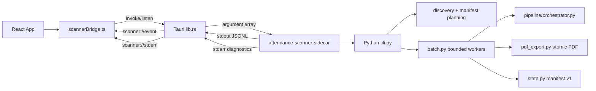

# Attendance Scanner Desktop — Developer and AI-Agent Handoff

This document is the implementation map for a new developer or coding agent.

## Architecture

## Entrypoints and ownership

- Python CLI: `scanner/src/attendance_scanner/cli.py`
  - `plan`: discovery, manifest load, classification, `scan_plan` JSONL.
  - `scan-batch`: plan event followed by per-file and completion events.
- Batch execution: `scanner/src/attendance_scanner/batch.py`
  - bounded `ThreadPoolExecutor`, per-file isolation, atomic manifest checkpoints,
    stable error mapping, and exit code 2 for file failures.
- Image pipeline: `scanner/src/attendance_scanner/pipeline/`
  - `load.py` decodes/normalizes images, `detect.py` finds document quads,
    `perspective.py` warps, `enhance.py` applies mode, and `orchestrator.py`
    assembles diagnostics.
- Output: `scanner/src/attendance_scanner/pdf_export.py` writes one-page PDFs via
  same-directory temporary files and atomic replace.
- State: `scanner/src/attendance_scanner/state.py` stores manifest schema v1 under
  `%APPDATA%\attendance-scanner\state`.
- Desktop bridge: `apps/desktop/src-tauri/src/lib.rs` owns sidecar lifecycle,
  protocol validation, stderr filtering, and Tauri commands `plan_scan`/`start_scan`.
- React UI: `apps/desktop/src/App.tsx`, `apps/desktop/src/lib/scannerBridge.ts`,
  and `apps/desktop/src/lib/scanExecutionReducer.ts` own plan/execution state and
  user-facing safe messages.

## JSONL protocol

stdout is reserved for one JSON object per line with `protocolVersion: 1` and a
non-empty timestamp. Current event types are:

- `scan_plan`: input/output roots and classification counters.
- `file_started`: relative source path, employee, index, total.
- `file_completed`: relative source path, employee, output-relative path, warning,
  detection flag, duration.
- `file_failed`: relative source path, employee, stable `errorCode`, safe message.
- `scan_completed`: authoritative success/warning/failure/skipped summary.

Never write debug text to stdout. Structured stderr diagnostics are parsed by the
Rust bridge; traceback and technical details are never forwarded to normal UI events.

## Manifest and incremental semantics

Manifest schema v1 contains `rootId`, canonical input/output roots, timestamps, and
entries keyed by normalized source-relative path. Each entry stores source size,
mtime, optional SHA-256, status, pipeline version, and output-relative path(s).

- New/modified/rebuild entries are the process set.
- Success and warning entries are terminal and become unchanged when source/output
  fingerprints still match.
- Failed entries remain retryable.
- Missing output selects rebuild.
- Deleted source history is retained; the MVP never deletes PDFs automatically.

Do not make source filename equal to document identity when extending the model.
The downstream AS-23–AS-30 work introduces period, document-group, page-order, and
multi-artifact contracts that must remain backward-compatible with the foundation.

## Build and test commands

From repository root:

    .\scripts\setup-env.ps1
    .\scripts\build-sidecar.ps1
    .\scripts\test-sidecar.ps1 -InputRoot "C:\path\to\representative\images"
    .\scripts\build-windows.ps1 -SmokeTestInputRoot "C:\path\to\representative\images"

Python checks from `scanner`:

    .\.venv\Scripts\pytest.exe tests -q
    .\.venv\Scripts\ruff.exe check src tests
    .\.venv\Scripts\mypy.exe src

Desktop checks from repository root:

    npm --prefix apps/desktop test -- --run
    npm --prefix apps/desktop run typecheck
    npm --prefix apps/desktop run build

Rust bridge checks use the real manifest code when the sidecar is available. For
unit-only runs with no external binary, set `TAURI_CONFIG` so `externalBin` is
empty, then run cargo test/clippy/rustfmt as documented in the task evidence.

## Where to tune scanner quality

- Detection thresholds and geometry: `scanner/src/attendance_scanner/pipeline/detect.py`,
  `DetectionConfig`.
- Perspective limits: `pipeline/perspective.py`, `PerspectiveConfig`.
- Enhancement behavior: `pipeline/enhance.py`, `EnhancementConfig`.
- Resize budget: `pipeline/orchestrator.py`, `ResizeConfig`.

Prefer adding a deterministic fixture and a tolerance-based assertion before
changing a threshold. Avoid pixel-perfect snapshots that make filter regressions
brittle.

## Release and privacy rules

- All scanning is local-first; no OCR, AI, cloud sync, or remote API is part of MVP.
- Do not commit real attendance images or PII. Use the synthetic corpus in
  `scanner/tests/fixture_corpus.py` and the fixture generator for package smoke tests.
- Generated target-triple sidecar executables are CI/release artifacts and are
  ignored by Git. The Windows workflow builds/uploads them before Tauri bundling.
- Clean Windows install/launch/relaunch/uninstall checks remain a separate release
  gate from static/unit success.

## Agent workflow

For every Notion task: fetch the current task, set it to `In progress`, inspect the
current source, implement only the scoped objective, run proportionate validation,
append evidence and re-fetch the page, then commit task-scoped changes. Preserve
unrelated work. Do not push unless the user explicitly requests it. Do not mark
Done when a required packaged, clean-environment, browser, or runtime gate is still
unverified.
